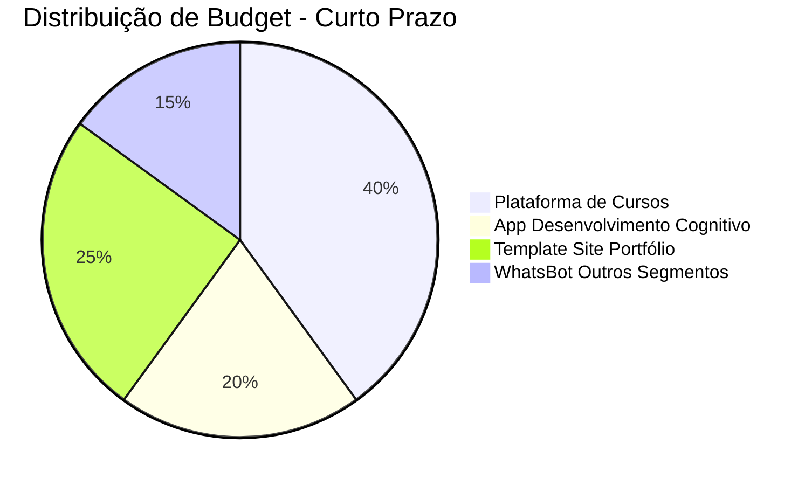
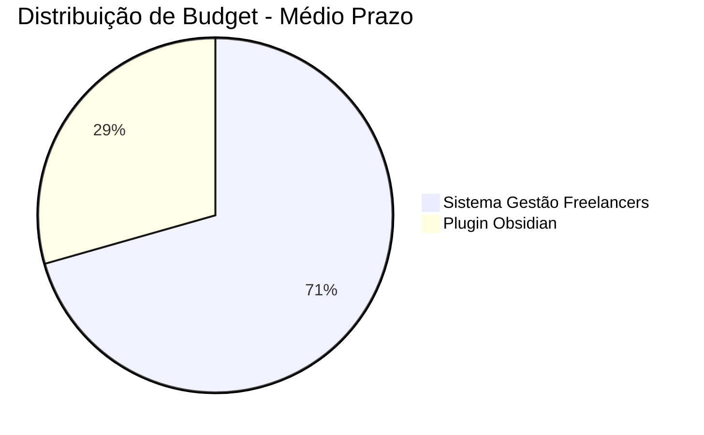
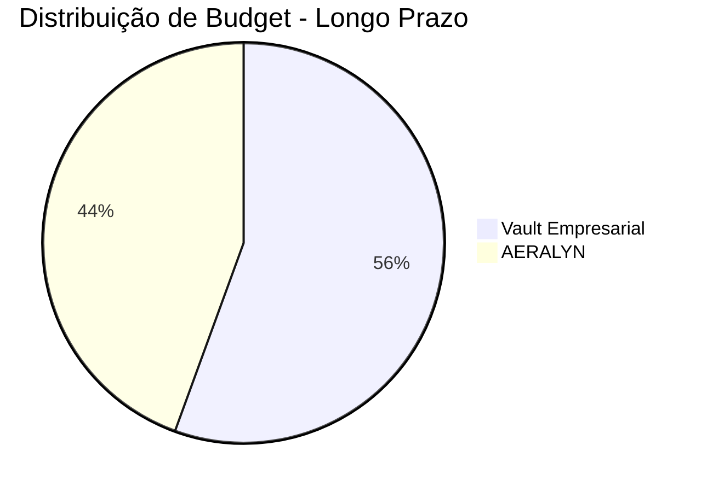
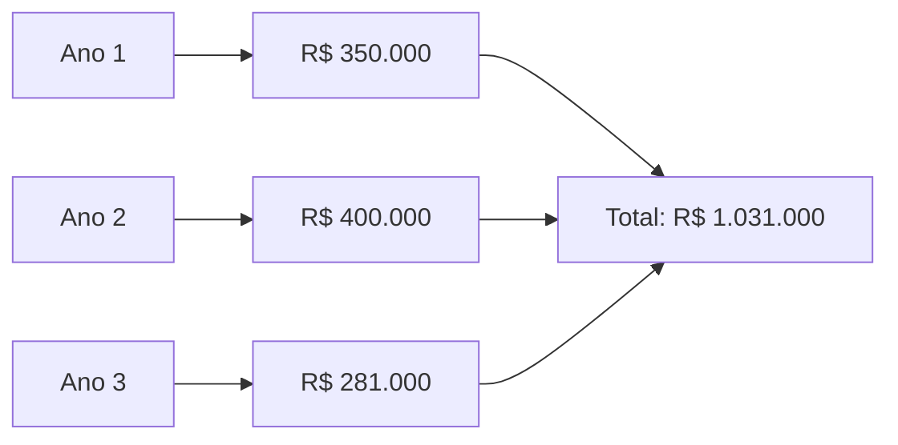

---
{"dg-publish":true,"permalink":"/0-dashboard-executivo/dashboard-projetos-prazo/","noteIcon":""}
---

# 📊 **DASHBOARD DE PROJETOS POR PRAZO**

> *Visão executiva dos projetos organizados por prazo de execução e prioridade*

---

## 🎯 **RESUMO EXECUTIVO**

### **Distribuição por Prazo**
- **Curto Prazo (1-3 meses)**: 4 projetos ativos
- **Médio Prazo (3-12 meses)**: 2 projetos ativos  
- **Longo Prazo (1-3 anos)**: 2 projetos ativos

### **Status Geral**
- **Total de Projetos**: 8 projetos ativos (excluindo templates)
- **Budget Total**: R$ 297.000
- **ROI Projetado**: 271% em 3 anos

---

## ⚡ **CURTO PRAZO (1-3 MESES)**

### **🚀 Projetos Prioritários**

#### **1. MVP da Plataforma de Cursos**
- **Status**: 🔄 Em desenvolvimento
- **Budget**: R$ 40.000
- **Prazo**: 3-4 meses
- **ROI**: 500%
- **Responsável**: [[Pedro Vitor\|Pedro Vitor]]
- **Progresso**: 0% implementado

#### **2. MVP do App Desenvolvimento Cognitivo**
- **Status**: ✅ Ativo
- **Budget**: R$ 20.000
- **Prazo**: 2-3 meses
- **ROI**: 350%
- **Responsável**: [[Pedro Vitor\|Pedro Vitor]]
- **Progresso**: 100% documentado, 0% implementado

#### **3. Template Site Portfólio para Outras Profissões**
- **Status**: 🔄 Em desenvolvimento
- **Budget**: R$ 25.000
- **Prazo**: 2-3 meses
- **ROI**: 300%
- **Responsável**: [[Pedro Vitor\|Pedro Vitor]]
- **Progresso**: 100% funcional (base)

#### **4. WhatsBot para Outros Segmentos**
- **Status**: 🔄 Em desenvolvimento
- **Budget**: R$ 15.000
- **Prazo**: 1-2 meses
- **ROI**: 250%
- **Responsável**: [[Pedro Vitor\|Pedro Vitor]]
- **Progresso**: 85% completo (base)

---

## 📈 **MÉDIO PRAZO (3-12 MESES)**

### **🏗️ Projetos Estratégicos**

#### **1. Sistema de Gestão de Projetos para Freelancers**
- **Status**: 💡 Ideia
- **Budget**: R$ 12.000
- **Prazo**: 2 meses
- **ROI**: 200%
- **Responsável**: [[Pedro Vitor\|Pedro Vitor]]
- **Progresso**: 0% implementado

#### **2. Plugin de Automação para Obsidian**
- **Status**: 💡 Ideia
- **Budget**: R$ 5.000
- **Prazo**: 1 mês
- **ROI**: 400%
- **Responsável**: [[Pedro Vitor\|Pedro Vitor]]
- **Progresso**: 0% implementado

---

## 🌟 **LONGO PRAZO (1-3 ANOS)**

### **🎯 Projetos Visionários**

#### **1. Vault Empresarial - Sistema de Gestão Completo**
- **Status**: ✅ Ativo
- **Budget**: R$ 100.000
- **Prazo**: 52 semanas
- **ROI**: 300%
- **Responsável**: [[Pedro Vitor\|Pedro Vitor]]
- **Progresso**: 95% implementado

#### **2. AERALYN - Sistema de RPG e Criação Narrativa**
- **Status**: ✅ Ativo
- **Budget**: R$ 80.000
- **Prazo**: 40 semanas
- **ROI**: 400%
- **Responsável**: [[Pedro Vitor\|Pedro Vitor]]
- **Progresso**: 100% implementado

---

## 📊 **MÉTRICAS POR PRAZO**

### **Curto Prazo (1-3 meses)**


### **Médio Prazo (3-12 meses)**


### **Longo Prazo (1-3 anos)**


---

## 🎯 **ROADMAP VISUAL**

### **Timeline de Execução**
```mermaid
gantt
    title Roadmap de Projetos por Prazo
    dateFormat YYYY-MM-DD
    section Curto Prazo
    Plataforma de Cursos    :active, curso, 2025-09-01, 3m
    App Desenvolvimento     :active, app, 2025-09-01, 2m
    Template Portfólio      :active, template, 2025-09-01, 2m
    WhatsBot Segmentos      :active, whatsbot, 2025-09-01, 1m
    
    section Médio Prazo
    Sistema Freelancers     :idea, freelancers, 2025-10-01, 2m
    Plugin Obsidian         :idea, plugin, 2025-10-01, 1m
    
    section Longo Prazo
    Vault Empresarial       :active, vault, 2025-09-01, 12m
    AERALYN                 :active, aeralyn, 2025-09-01, 10m
```

---

## 💰 **ANÁLISE FINANCEIRA**

### **Investimento por Prazo**
| Prazo | Projetos | Budget Total | ROI Médio | Receita Projetada |
|-------|----------|--------------|-----------|-------------------|
| **Curto Prazo** | 4 | R$ 100.000 | 350% | R$ 350.000 |
| **Médio Prazo** | 2 | R$ 17.000 | 300% | R$ 51.000 |
| **Longo Prazo** | 2 | R$ 180.000 | 350% | R$ 630.000 |
| **TOTAL** | **8** | **R$ 297.000** | **347%** | **R$ 1.031.000** |

### **Projeção de Receita (3 Anos)**


---

## 🚨 **ALERTAS E RISCOS**

### **Projetos em Risco**
- **Plataforma de Cursos**: 0% implementado, prazo apertado
- **App Desenvolvimento**: Apenas documentado, falta implementação
- **WhatsBot Segmentos**: Depende de base existente

### **Oportunidades**
- **Vault Empresarial**: 95% pronto, pronto para comercialização
- **AERALYN**: 100% completo, pronto para lançamento
- **Template Portfólio**: Base sólida para expansão

---

## 📈 **KPIs POR PRAZO**

### **Curto Prazo (1-3 meses)**
- **Meta**: 4 MVPs funcionais
- **Receita**: R$ 350.000
- **Usuários**: 500+
- **Validação**: 10+ clientes

### **Médio Prazo (3-12 meses)**
- **Meta**: 2 produtos escaláveis
- **Receita**: R$ 51.000
- **Usuários**: 1.000+
- **Market Share**: 5%

### **Longo Prazo (1-3 anos)**
- **Meta**: 2 plataformas dominantes
- **Receita**: R$ 630.000
- **Usuários**: 10.000+
- **Valor da Empresa**: R$ 10M+

---

## 🎯 **PRÓXIMAS AÇÕES**

### **Esta Semana**
1. **Priorizar** projetos de curto prazo
2. **Iniciar** desenvolvimento da Plataforma de Cursos
3. **Validar** mercado para App Desenvolvimento Cognitivo

### **Próximo Mês**
1. **Finalizar** 2 MVPs de curto prazo
2. **Preparar** lançamento do Vault Empresarial
3. **Iniciar** planejamento de projetos de médio prazo

### **Próximo Trimestre**
1. **Lançar** 3 produtos de curto prazo
2. **Comercializar** Vault Empresarial e AERALYN
3. **Validar** ideias de médio prazo

---

## 🔗 **LINKS RÁPIDOS**

### **Projetos Ativos**
- [[4-Projetos/Ativos/PRJ-Vault-Empresarial\|PRJ-Vault-Empresarial]] - Sistema de gestão empresarial
- [[4-Projetos/Ativos/PRJ-AERALYN\|PRJ-AERALYN]] - Sistema de RPG
- [[4-Projetos/Ativos/PRJ-Plataforma-Cursos\|PRJ-Plataforma-Cursos]] - Plataforma de cursos online
- [[4-Projetos/Ativos/PRJ-App-Desenvolvimento-Cognitivo\|PRJ-App-Desenvolvimento-Cognitivo]] - App de desenvolvimento cognitivo

### **Projetos em Desenvolvimento**
- [[4-Projetos/Em-Desenvolvimento/PRJ-Dev-WhatsBot-Academia\|PRJ-Dev-WhatsBot-Academia]] - WhatsBot para academias
- [[4-Projetos/Em-Desenvolvimento/PRJ-Web-Site-Portfolio-Engenharia\|PRJ-Web-Site-Portfolio-Engenharia]] - Site portfólio

### **Sistema de Ideias**
- [[SISTEMA_GERACAO_IDEIAS\|SISTEMA_GERACAO_IDEIAS]] - Sistema de geração de ideias

---

**Status**: ✅ **ATIVO**  
**Última Atualização**: 2025-09-01  
**Próxima Revisão**: 2025-09-15
