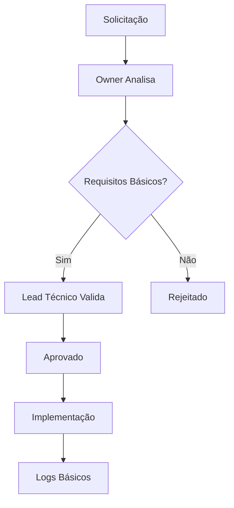
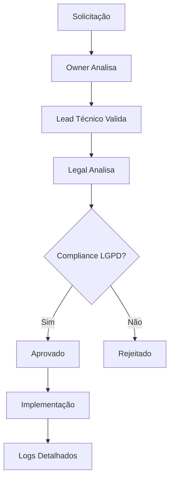
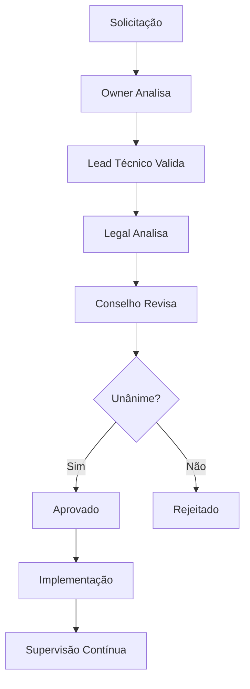

---
{"dg-publish":true,"permalink":"/1-governanca/etica-uso-ia/","noteIcon":""}
---

# 🧠 **POLÍTICA DE ÉTICA E USO DE INTELIGÊNCIA ARTIFICIAL**

> *Política completa para uso responsável e ético de IA na empresa*

---

## 📋 **RESUMO EXECUTIVO**

### **Objetivo**
Estabelecer diretrizes claras para o uso responsável, ético e seguro de Inteligência Artificial em todas as atividades da empresa, garantindo conformidade com LGPD e boas práticas internacionais.

### **Escopo**
Aplica-se a todos os colaboradores, sócios, terceiros e sistemas que utilizem ou interajam com tecnologias de IA na empresa.

### **Princípios Fundamentais**
1. **Human-in-the-Loop**: Decisões críticas sempre com supervisão humana
2. **Transparência**: Processos de IA explicáveis e auditáveis
3. **Privacidade**: Proteção total de dados pessoais
4. **Responsabilidade**: Accountability clara em todas as decisões
5. **Benefício Social**: IA deve gerar valor para sociedade

---

## 🎯 **PRINCÍPIOS FUNDAMENTAIS**

### **1. Human-in-the-Loop Obrigatório**
- **Decisões Críticas**: Sempre requerem aprovação humana
- **Supervisão Contínua**: Monitoramento de outputs de IA
- **Capacidade de Override**: Humanos podem sempre interromper processos
- **Responsabilidade Final**: Humanos são sempre responsáveis pelas decisões

### **2. Transparência e Explicabilidade**
- **Processos Documentados**: Todos os usos de IA devem ser documentados
- **Decisões Rastreáveis**: Logs completos de todas as decisões
- **Explicação Disponível**: Capacidade de explicar decisões quando solicitado
- **Auditoria Independente**: Processos auditáveis por terceiros

### **3. Proteção de Privacidade**
- **Minimização de Dados**: Coleta mínima necessária
- **Anonimização**: Dados pessoais sempre anonimizados
- **Consentimento Explícito**: Consentimento claro e específico
- **Direito ao Esquecimento**: Capacidade de remoção de dados

### **4. Responsabilidade e Accountability**
- **Responsabilidade Clara**: Definir quem é responsável por cada decisão
- **Cadeia de Comando**: Hierarquia clara de responsabilidades
- **Consequências Definidas**: Penalidades por violações
- **Revisão Regular**: Avaliação periódica de compliance

---

## 📊 **NÍVEIS DE COMPLIANCE**

### **Nível 1: Básico (Compliance Básico)**
**Aplicação**: Uso interno, sem dados pessoais, sem impacto crítico

**Requisitos**:
- [ ] Aprovação do Owner do projeto
- [ ] Documentação básica do uso
- [ ] Logs de uso mantidos por 30 dias
- [ ] Sem dados pessoais envolvidos
- [ ] Impacto limitado ao projeto

**Processo de Aprovação**:
1. **Solicitação**: Owner do projeto
2. **Análise**: Verificação de requisitos básicos
3. **Aprovação**: Owner + Lead técnico
4. **Implementação**: Com logs básicos

### **Nível 2: Dados (Compliance com Dados)**
**Aplicação**: Uso com dados pessoais, impacto moderado

**Requisitos**:
- [ ] Aprovação do Owner + Legal
- [ ] Análise de impacto à privacidade
- [ ] Logs detalhados por 90 dias
- [ ] Consentimento explícito obtido
- [ ] Revisão legal obrigatória

**Processo de Aprovação**:
1. **Solicitação**: Owner do projeto
2. **Análise Técnica**: Lead técnico
3. **Análise Legal**: Participante 6
4. **Aprovação**: Owner + Legal + Lead técnico
5. **Implementação**: Com logs detalhados

### **Nível 3: Crítico (Compliance Crítico)**
**Aplicação**: Decisões críticas, alto impacto, dados sensíveis

**Requisitos**:
- [ ] Aprovação do Conselho completo
- [ ] Análise de impacto completa
- [ ] Logs permanentes
- [ ] Auditoria externa obrigatória
- [ ] Human-in-the-loop obrigatório
- [ ] Plano de contingência

**Processo de Aprovação**:
1. **Solicitação**: Owner do projeto
2. **Análise Técnica**: Lead técnico
3. **Análise Legal**: Participante 6
4. **Análise de Riscos**: Conselho
5. **Aprovação**: Conselho completo
6. **Implementação**: Com supervisão contínua

---

## 🔒 **CONTROLES DE SEGURANÇA**

### **Proteção de Dados**
- **Criptografia**: Todos os dados em trânsito e repouso
- **Acesso Limitado**: Acesso baseado em necessidade
- **Auditoria**: Logs de acesso completos
- **Backup Seguro**: Backups criptografados
- **Retenção**: Política clara de retenção de dados

### **Monitoramento e Alertas**
- **Monitoramento Contínuo**: 24/7 monitoramento de sistemas
- **Alertas Automáticos**: Notificação imediata de violações
- **Análise de Comportamento**: Detecção de anomalias
- **Relatórios Regulares**: Relatórios semanais de compliance
- **Revisão Mensal**: Revisão completa mensal

### **Contingência e Recuperação**
- **Plano de Contingência**: Plano para falhas de IA
- **Recuperação de Dados**: Processo de recuperação
- **Comunicação de Crise**: Protocolo de comunicação
- **Análise Pós-Incidente**: Análise completa após incidentes
- **Melhorias Contínuas**: Implementação de melhorias

---

## 📝 **PROCESSOS DE APROVAÇÃO**

### **Fluxo de Aprovação Nível 1**

### **Fluxo de Aprovação Nível 2**

### **Fluxo de Aprovação Nível 3**

---

## 📊 **MÉTRICAS DE COMPLIANCE**

### **Indicadores de Performance**
- **Taxa de Aprovação**: % de solicitações aprovadas
- **Tempo de Aprovação**: Tempo médio de aprovação
- **Taxa de Violação**: % de violações de política
- **Tempo de Resposta**: Tempo para responder a incidentes
- **Satisfação**: Satisfação da equipe com processos

### **Metas de Compliance**
- **100%** de solicitações com documentação completa
- **<48h** tempo médio de aprovação
- **0** violações de política por mês
- **<2h** tempo de resposta a incidentes
- **>90%** satisfação da equipe

---

## 🚨 **PROCEDIMENTOS DE VIOLAÇÃO**

### **Identificação de Violação**
1. **Detecção**: Sistema automático ou reporte manual
2. **Classificação**: Severidade da violação
3. **Notificação**: Comunicação imediata aos responsáveis
4. **Contenção**: Ação imediata para conter danos
5. **Análise**: Investigação completa do incidente

### **Resposta a Incidentes**
1. **Imediata**: Contenção e comunicação
2. **Curto Prazo**: Análise e correção
3. **Médio Prazo**: Melhorias e prevenção
4. **Longo Prazo**: Revisão de políticas

### **Penalidades**
- **Advertência**: Para violações menores
- **Suspensão**: Para violações moderadas
- **Terminação**: Para violações graves
- **Legal**: Para violações que envolvem lei

---

## 📅 **REVISÕES E ATUALIZAÇÕES**

### **Cronograma de Revisão**
- **Revisão Menor**: A cada 3 meses
- **Revisão Maior**: A cada 6 meses
- **Revisão Completa**: Anual
- **Revisão Emergencial**: Conforme necessidade

### **Processo de Atualização**
1. **Identificação**: Necessidade de atualização
2. **Proposta**: Nova versão da política
3. **Revisão**: Análise por stakeholders
4. **Aprovação**: Aprovação pelo conselho
5. **Implementação**: Implementação e treinamento

---

## 📚 **TREINAMENTO E EDUCAÇÃO**

### **Programa de Treinamento**
- **Orientação**: Para novos colaboradores
- **Atualização**: Para mudanças na política
- **Refresher**: Treinamento anual obrigatório
- **Especializado**: Para usuários avançados

### **Materiais de Treinamento**
- **Manual**: Guia completo da política
- **Vídeos**: Treinamentos em vídeo
- **FAQ**: Perguntas frequentes
- **Cases**: Casos de estudo reais

---

## 🔗 **DOCUMENTOS RELACIONADOS**

- [[z_Templates/Empresariais/Template_Acordo_Socios\|Template_Acordo_Socios]] - Acordo societário
- [[z_Templates/Empresariais/Template_Politica_Financeira\|Template_Politica_Financeira]] - Política financeira
- [[CHECKLIST_FINAL\|CHECKLIST_FINAL]] - Checklist de compliance
- [[SPRINTS_FINAL\|SPRINTS_FINAL]] - Cronograma de implementação

---

## 📞 **CONTATOS DE EMERGÊNCIA**

### **Equipe de Compliance**
- **Lead Compliance**: [[Participante 6\|Participante 6]] - [Telefone]
- **Lead Técnico**: [[Pedro Vitor\|Pedro Vitor]] - [Telefone]
- **Lead Legal**: [[Participante 6\|Participante 6]] - [Telefone]

### **Contatos de Emergência**
- **24/7**: [Número de emergência]
- **Email**: compliance@empresa.com
- **Slack**: #compliance-emergency

---

**Status**: ✅ **ATIVO**  
**Próxima Revisão**: 30/11/2025  
**Owner**: [[Participante 6\|Participante 6]]
