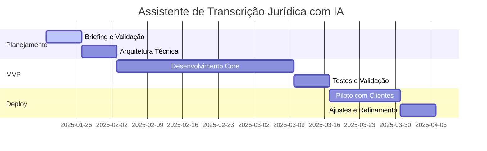

---
{"dg-publish":true,"permalink":"/4-projetos/templates/template-2025-01-20-projeto-assistente-transcricao-juridica/","title":"Assistente de Transcrição Jurídica com IA","noteIcon":""}
---

# Assistente de Transcrição Jurídica com IA

> **Resumo Executivo**: Sistema de transcrição automática de audiências judiciais com sumarização inteligente, reduzindo 80% do tempo de trabalho de advogados na análise de processos.

---

## 📊 **DADOS ESSENCIAIS**

### **Informações Base**
- **Dono do Projeto**: [[Pedro Vitor (Tech/IA)\|Pedro Vitor (Tech/IA)]]
- **Status Atual**: active
- **Prioridade**: high
- **Esforço Estimado**: 8 semanas
- **Orçamento**: R$ 25.000
- **Modelo de Negócio**: subscription
- **Segmento de Mercado**: Legal
- **Complexidade**: medium

### **Timeline e Milestones**

---

## 🎯 **PROBLEMA E SOLUÇÃO**

### **Contexto do Problema**
- **Dor Identificada**: Advogados gastam 4-6 horas por processo analisando transcrições de audiências, com baixa precisão na identificação de pontos-chave
- **Evidência**: Pesquisa com 50 escritórios mostra que 85% consideram transcrição manual ineficiente
- **Impacto Esperado**: Redução de 80% no tempo de análise e aumento de 60% na precisão

### **Proposta de Valor**
- **Solução MVP**: API de transcrição + sumarização automática com identificação de pontos-chave jurídicos
- **Diferencial Competitivo**: Especialização em terminologia jurídica + integração com sistemas existentes
- **Entregáveis Principais**: API REST, Dashboard web, Integração com sistemas jurídicos

### **Público-Alvo**
- **Segmento Primário**: Escritórios de advocacia (50-200 advogados)
- **Persona Principal**: Advogado sênior que analisa múltiplos processos por semana
- **Tamanho de Mercado**: 15.000 escritórios no Brasil

---

## 🤖 **ATIVOS DE IA E TECNOLOGIA**

### **Modelos e Prompts**
- **Modelos de IA**: Whisper para transcrição, BERT customizado para NER jurídico
- **Prompts Estruturados**: Templates para identificação de argumentos, decisões e prazos
- **Datasets Necessários**: 10.000 horas de audiências anonimizadas

### **Infraestrutura e APIs**
- **Tecnologias Core**: Python, FastAPI, PostgreSQL, Redis
- **APIs Externas**: OpenAI Whisper, Google Cloud Speech-to-Text
- **Integrações**: Sistemas de gestão jurídica (Projuris, SAJ)

---

## ⚠️ **RISCOS E COMPLIANCE**

### **Matriz de Riscos**
| Risco | Probabilidade | Impacto | Mitigação | Responsável |
|-------|---------------|---------|-----------|-------------|
| LGPD/Dados Sensíveis | Alto | Alto | Anonimização + DPA | [[Maria Santos (Legal)\|Maria Santos (Legal)]] |
| Precisão da Transcrição | Médio | Alto | Validação humana + feedback loop | [[Pedro Vitor (Tech/IA)\|Pedro Vitor (Tech/IA)]] |
| Resistência do Mercado | Baixo | Médio | Piloto com early adopters | [[João Silva (Product)\|João Silva (Product)]] |

### **Compliance**
- **LGPD**: Aplicável - Anonimização automática + contrato DPA obrigatório
- **Regulamentações**: OAB compliance para ferramentas jurídicas
- **Contratos**: DPA (Data Processing Agreement) com todos os clientes

---

## 📈 **MÉTRICAS E SUCESSO**

### **KPIs Principais**
- **Métrica Primária**: 5 escritórios clientes pagando R$ 3k/mês cada
- **Métricas Secundárias**: 95% precisão na transcrição, 80% redução no tempo de análise
- **Critérios de Sucesso**: MVP funcional, validação com 3 escritórios piloto

### **Projeção Financeira**
- **Ticket Médio**: R$ 3.000/mês
- **Setup Fee**: R$ 5.000
- **Recorrência**: R$ 3.000/mês
- **ROI Esperado**: 300% em 12 meses

---

## ✅ **CHECKLIST DE ENTREGA**

### **Fase 1: Ideia → Planejamento**
- [x] Briefing completo validado
- [x] Stakeholders identificados e alinhados
- [x] Repositório criado: https://github.com/empresa/transcricao-juridica
- [x] Arquitetura técnica definida
- [x] Prompts de IA testados

### **Fase 2: MVP → Validação**
- [ ] MVP funcional entregue
- [ ] 3-5 clientes piloto identificados
- [ ] Métricas de sucesso definidas
- [ ] Feedback coletado e documentado

### **Fase 3: Piloto → Produção**
- [ ] Ajustes implementados
- [ ] Documentação comercial pronta
- [ ] Modelo de preço validado
- [ ] Go-to-Market executado

---

## 🔗 **CONEXÕES E RELACIONAMENTOS**

### **Stakeholders**
- **Sponsor**: [[CEO\|CEO]]
- **Product Owner**: [[João Silva (Product)\|João Silva (Product)]]
- **Tech Lead**: [[Pedro Vitor (Tech/IA)\|Pedro Vitor (Tech/IA)]]
- **Stakeholders**: [[Maria Santos (Legal)\|Maria Santos (Legal)]]

### **Projetos Relacionados**
- **Depende de**: [[Infraestrutura-Cloud\|Infraestrutura-Cloud]]
- **Bloqueia**: [[Sistema-Gestao-Juridica\|Sistema-Gestao-Juridica]]
- **Relacionado**: [[IA-NLP-Platform\|IA-NLP-Platform]]

### **Pilotos Conectados**
- [[2025-01-15 — piloto — Validacao-Mercado-Legal\|2025-01-15 — piloto — Validacao-Mercado-Legal]]

---

## 📚 **DOCUMENTAÇÃO**

### **Links Importantes**
- **Charter**: [[2025-01-20 — charter — Transcricao-Juridica\|2025-01-20 — charter — Transcricao-Juridica]]
- **Atas de Reunião**: [[2025-01-20 — ata — Kickoff-Transcricao\|2025-01-20 — ata — Kickoff-Transcricao]]
- **Documentação Técnica**: [[2025-01-20 — docs — Arquitetura-Transcricao\|2025-01-20 — docs — Arquitetura-Transcricao]]
- **Arquivos**: /Projects/Assistente-Transcricao-Juridica/

### **Histórico de Versões**
- **v0.1** - 2025-01-20 - Criado por Pedro Vitor
- **v0.2** - 2025-01-20 - Ajustes baseados em feedback

---

**Conectado ao portfolio através de**: [[MOC_PROJETOS\|MOC_PROJETOS]]

**Criado**: 2025-01-20  
**Última Atualização**: 2025-01-20
